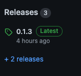
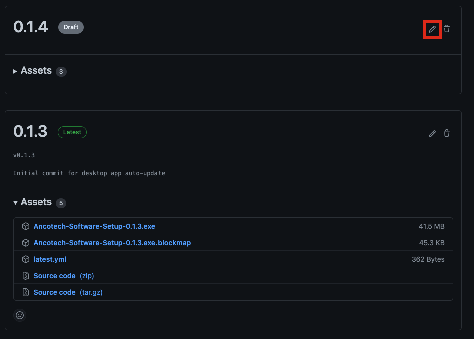
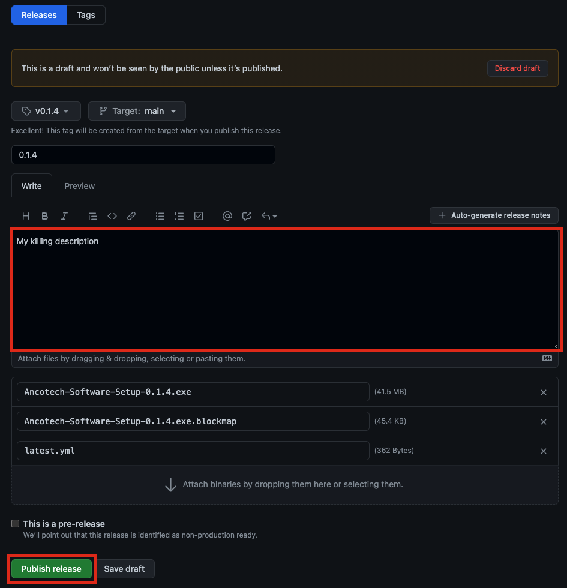
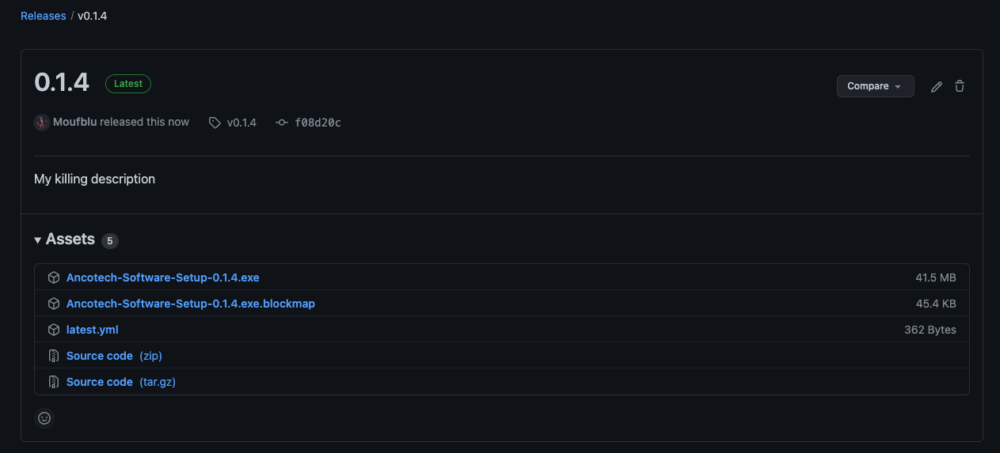

# Ancotech software releases

This repository exists only to store the releases of the desktop application of the Ancotech software web solution.

This readme explains how to create and deploy a release as well as the related constraints.

## Pre-requisites

Before deploying the Ancotech software, you have to make sure that the following pre-requisites are available and ready:

1. Creating a release for the Ancotech software is currently only possible on Windows.
2. The repository containing the Ancotech software `desktop-app` folder should be on your machine. It should be up-to-date with the `master` branch.
3. You have `npm` installed on your machine.
4. You have access to this repository
5. The Github access token is still valid
6. The Github access token has `repo` permissions

## Electron-builder auto-updater configuration

The configuration for electron-builder auto-updater is done in a `electron-builder.yml` file. A schema of this file is present in the `desktop-app` folder with the name `electron-builder.schema.yml`.

The schema is structured as follows:

```yml
appId: [YOUR APP ID]
publish:
  provider: [YOUR PROVIDER]
  token: [YOUR ACCESS TOKEN]
```

Every missing value of this file can be found in the secret manager app of the Ancotech software development team.

## Installation

The desktop app should be installed before building and deploying. To do so, execute the following shell commands in the `desktop-app` root folder.

```shell
npm install
npm run electron:generate-icons
```

You can check if most of the pre-requisites are met by building the app at this point:

```shell
npm run electron:build:win
```

## Version

The version of the app is the value of the `version` key in the `desktop-app`'s `package.json` file.

Its structure is the following: MAJOR.MINOR.PATCH

For example: 1.2.3 is major version 1, minor version 2 and patch version 3.

## Deployment

The deployment of the app is done via the following steps:

1. Update the `version` of the `desktop-app`
2. Execute the `package.json` deployment script

    ```shell
    npm run electron:deploy:win
    ```

3. After the deployment script is finished, go to the Github releases of this repository
   
4. Modify the draft corresponding to the version you just deployed
   
5. (Optionnaly) write a description for the release
6. Publish the draft as a release
   

And there you have it! A new release for the Ancotech software's desktop app!


You should now be warning about a new version of the app when opening the Ancotech software.

## Appendix

Note that it is not mandatory that the release contains the same code as the `master` branch of `desktop-app`.
